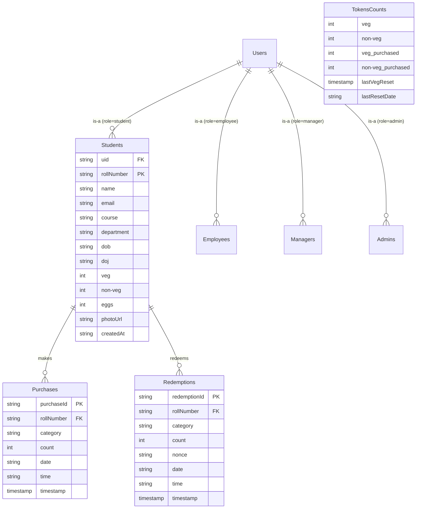

# PSG Mess Token System v2.0.0

A modern, cross-platform digital meal token management system for PSG hostel dining facilities, built with **Flutter**, **Firebase Cloud Firestore**, **Firebase Authentication**, **Riverpod**, and **Cloudinary**.

---

## Table of Contents

- [Project Overview](#project-overview)
- [Setup and Installation](#setup-and-installation)
- [Application Workflow](#application-workflow)
  - [1. Student Role](#1-student-role)
  - [2. Mess Manager Role](#2-mess-manager-role)
  - [3. Employee / Staff Role](#3-employee--staff-role)
  - [4. Admin Master Console Role](#4-admin-master-console-role)
  - [5. Daily Token Reset & Time-Window Rules](#5-daily-token-reset--time-window-rules)
- [Project Architecture & Directory Structure](#project-architecture--directory-structure)
- [Entity-Relationship Diagram (ERD) & Database Schema](#entity-relationship-diagram-erd--database-schema)
  - [Firestore Collections Schema](#firestore-collections-schema)
- [Environment Configuration](#environment-configuration)
- [Firebase / Firestore Setup](#firebase--firestore-setup)
- [`init_firebase.py` Setup and Usage](#init_firebasepy-setup-and-usage)
  - [Sample `init_firebase.py` Initialization Script](#sample-init_firebasepy-initialization-script)
  - [Demo Test Accounts Credentials](#demo-test-accounts-credentials)
- [License & Security Disclaimer](#license--security-disclaimer)

---

## Project Overview

The **PSG Mess Token System** streamlines digital dining pass purchasing, wallet storage, and redemption verification across hostel dining halls. It replaces traditional paper tokens with dynamic single-use QR codes and real-time inventory tracking.

### Key Capabilities

* **Role-Based Access Control**: Tailored dashboards for Students, Mess Managers, Mess Staff/Employees, and System Admins.
* **Daily Token Pools & Window Governance**: Automatic 00:00 UTC/IST resets (Veg quota defaults to 5,000 daily). Student purchases open after 6:00 AM; Manager pool updates permitted strictly before 6:00 AM.
* **Egg Token Stepper & Wallet Locking**: Egg tokens purchased in batches of 15. Stepper increment/decrement buttons automatically lock when a student holds active egg tokens.
* **Single-Use QR Counter Redemption**: Mobile camera scanner terminal (`mobile_scanner`) with atomic transactions that validate student balance, prevent double redemption, and format instant success responses.
* **Dual History Tracking**: Separate tabs for **Purchases History** and **Used / Redeemed Transactions**.
* **Cloudinary Profile Photo Integration**: Secure avatar upload and responsive image caching via Cloudinary REST API.
* **Full Firebase Account Synchronization**: Synchronized user deletion across Firestore collections and Firebase Authentication.

---

## Setup and Installation

### Prerequisites

* **Flutter SDK**: v3.19.0 or higher
* **Dart SDK**: v3.3.0 or higher
* **Python**: v3.8 or higher (for `init_firebase.py`)
* **Firebase Account**: Access to Firebase Console to provision Firestore & Authentication.
* **Cloudinary Account**: Cloud name & unsigned upload preset for profile images.

### Installation Steps

1. **Clone the Repository**
   ```bash
   git clone https://github.com/Sanjeeth18/Token_system.git
   cd Token_system
   ```

2. **Install Flutter Dependencies**
   ```bash
   flutter pub get
   ```

3. **Configure Environment Variables**
   Create a `.env` file in the project root by copying the provided example:
   ```bash
   cp .env.example .env
   ```
   *(See [Environment Configuration](#environment-configuration) for required keys).*

4. **Add Firebase Configuration**
   - **Android**: Place `google-services.json` inside `android/app/`.
   - **iOS**: Place `GoogleService-Info.plist` inside `ios/Runner/`.

5. **Initialize Firebase & Firestore Seed Data**
   ```bash
   pip install firebase-admin python-dotenv
   python init_firebase.py serviceAccountKey.json
   ```

6. **Run the Application**
   ```bash
   # Run on connected mobile device or emulator
   flutter run

   # Run on Chrome for web preview
   flutter run -d chrome
   ```

---

## Application Workflow

### 1. Student Role

```
[Login] ──► [Home Dashboard] ──► [Meal Booking Menu] ──► [Atomic Purchase] ──► [Active Wallet] ──► [QR Scanner Redemption]
```

* **Meal Booking**:
  - **Veg Meal**: 1 token per day. Enabled after 6:00 AM if available in daily pool.
  - **Non-Veg Meal**: Served on scheduled days (Sunday, Wednesday, Friday). Enabled after 6:00 AM.
  - **Egg Tokens**: Purchased in batches of 15. When `active egg count > 0`, quantity adjustment buttons (`+` / `-`) are locked.
* **Token Pass Wallet & QR Generation**:
  - Students present single-use QR passes (`<RollNumber> <Type> <Count> <Nonce>`).
* **Transaction History**:
  - **Purchases Tab**: Displays itemized receipt history (category, count, date, time).
  - **Used History Tab**: Displays counter redemption timestamps and staff verification records.
* **Profile Management**:
  - Change password with strong validation rules (min 10 characters, upper/lowercase, digits, special symbols).

### 2. Mess Manager Role

* **Token Pool Management**:
  - Sets or updates daily available **Veg** and **Non-Veg** token quotas strictly before 6:00 AM each day. Option locks automatically after 6:00 AM.
* **User Lifecycle Management**:
  - Create new Student, Employee, Manager, or Admin accounts.
  - Delete student accounts with automatic cross-deletion of Firestore documents and Firebase Auth accounts.
* **Audit & Live Statistics**:
  - Monitor real-time total, purchased, and redeemed token metrics.

### 3. Employee / Staff Role

* **Counter Scan Terminal**:
  - Built-in camera scanner powered by `mobile_scanner`.
  - Executes atomic transaction to verify student token balance, deduct tokens, and register nonces to eliminate duplicate redemptions.
  - Returns clear feedback messages (e.g., `"2 Egg tokens redeemed successfully"`).

### 4. Admin Master Console Role

* **System Supervision**:
  - View member list grouped by roles (Admins, Managers, Employees, Students).
  - Create/delete accounts across all administrative tiers.
  - Full access to global system metrics and audit history.

### 5. Daily Token Reset & Time-Window Rules

* **00:00 Daily Reset**:
  - Automatically resets Veg token quota to **5,000** at midnight.
  - Tracks reset date using `lastResetDate` formatted as `YYYY-MM-DD`.
* **6:00 AM Time-Window Governance**:
  - **Students**: Token purchases are disabled prior to 6:00 AM. Attempting to purchase before 6:00 AM displays `"Token purchases open after 6:00 AM."`
  - **Managers**: Quota editing is allowed strictly before 6:00 AM. Attempting to edit after 6:00 AM displays `"Token pool updates are allowed only before 6:00 AM."`

---

## Project Architecture & Directory Structure

The project follows a **Layered Clean Architecture**:

```
lib/
├── core/                       # Shared application logic & utilities
│   ├── constants/              # AppConstants, collection names, routes, courses
│   ├── error/                  # AppException classes & error sanitization
│   ├── theme/                  # AppColors, typography, glassmorphism theme
│   └── utils/                  # Date & time window calculation utilities
├── models/                     # Data models with JSON serialization
│   ├── token_model.dart        # StudentTokens, TokenCounts, TokenSelection
│   ├── transaction_model.dart  # TokenTransaction (Purchases & Redemptions)
│   └── user_model.dart         # UserSession, UserRole, UserProfile
├── providers/                  # Riverpod StateNotifier & AsyncNotifier providers
│   ├── auth_provider.dart      # Auth state & session lifecycle
│   ├── student_provider.dart   # Student profile & token wallet providers
│   └── token_provider.dart     # Token counts & selection state
├── repositories/               # Data access layer
│   └── firestore_repository.dart # Atomic Firestore queries & transactions
├── screens/                    # User interface screens grouped by domain
│   ├── admin/                  # Admin master console & view members
│   ├── auth/                   # Login & credentials authentication
│   ├── employee/               # Staff scanner & counter redemption
│   ├── manager/                # Manager console, user creation/deletion
│   ├── profile/                # User profile & avatar editor
│   └── student/                # Student home, wallet, QR display
├── services/                   # External API services
│   └── cloudinary_service.dart # Image upload & Cloudinary API handling
└── widgets/                    # Reusable UI widgets & components
    ├── admin/                  # Quick action & history cards
    ├── profile/                # Change password dialog & banner
    ├── app_scaffold.dart       # Standardized application scaffold
    ├── error_dialog.dart       # AppFeedback snackbar & alert dialogs
    └── token_card.dart         # Token selection & wallet cards
```

---

## Entity-Relationship Diagram (ERD) & Database Schema



### Firestore Collections Schema

| Collection | Document ID | Key Fields | Description |
| :--- | :--- | :--- | :--- |
| **`Students`** | Roll Number (e.g. `22PW33`) | `uid`, `name`, `email`, `course`, `department`, `veg`, `non-veg`, `eggs`, `photoUrl`, `createdAt` | Student profile & live token balance |
| **`Managers`** | Manager ID (e.g. `M101`) | `uid`, `name`, `email`, `role`, `department`, `photoUrl`, `createdAt` | Mess Manager accounts |
| **`Employees`** | Staff ID (e.g. `E101`) | `uid`, `name`, `email`, `role`, `department`, `dob`, `doj`, `photoUrl`, `createdAt` | Mess counter staff accounts |
| **`Admins`** | Admin ID (e.g. `A101`) | `uid`, `name`, `email`, `role`, `department`, `photoUrl`, `createdAt` | System Administrator accounts |
| **`Tokens`** | Document `Counts` | `veg`, `non-veg`, `veg_purchased`, `non-veg_purchased`, `lastVegReset`, `lastResetDate` | Global daily token inventory pool |
| **`Purchases`** | Auto-generated ID | `rollNumber`, `category`, `count`, `date`, `time`, `timestamp` | Audit log of token purchases |
| **`Redemptions`** | Auto-generated ID | `rollNumber`, `category`, `count`, `nonce`, `date`, `time`, `timestamp` | Audit log of counter redemptions |

---

## Environment Configuration

Create a `.env` file in the root directory.

### `.env` File Template

```env
# Application Environment
APP_NAME="PSG Mess Token System"
APP_ENV="development"

# Cloudinary Configuration
CLOUDINARY_CLOUD_NAME="XXXXXX"
CLOUDINARY_UPLOAD_PRESET="XXXXXX"
CLOUDINARY_API_KEY="XXXXXX"
CLOUDINARY_API_SECRET="XXXXXX"

# Firebase Configuration
FIREBASE_PROJECT_ID="XXXXXX"
```

---

## Firebase / Firestore Setup

1. **Create Firebase Project**:
   - Go to [Firebase Console](https://console.firebase.google.com/) and create a new project.
2. **Enable Firebase Authentication**:
   - Navigate to **Build -> Authentication**.
   - Enable **Email/Password** sign-in provider.
3. **Provision Cloud Firestore**:
   - Navigate to **Build -> Firestore Database**.
   - Select **Start in production mode** (or test mode for local setup).
4. **Deploy Security Rules**:
   - Ensure authenticated users have access to their respective documents while preserving permission checks.

---

## `init_firebase.py` Setup and Usage

The `init_firebase.py` script performs a full database reset, clears Firebase Authentication users, and seeds standard demo accounts and token counts.

### Requirements

```bash
pip install firebase-admin python-dotenv
```

### Service Account Key Setup

1. Open **Firebase Console -> Project Settings -> Service accounts**.
2. Click **Generate new private key** and download the JSON file.
3. Save the key file as `serviceAccountKey.json` in the project root.

### Execution Command

```bash
python init_firebase.py serviceAccountKey.json
```

---

### Sample `init_firebase.py` Initialization Script

```python
#!/usr/bin/env python3
"""
PSG Mess Token System - Firebase Full Reset & Initialization Script
"""

import sys
import os
import datetime
import firebase_admin
from firebase_admin import credentials, firestore, auth

def initialize_firebase(key_path):
    if not os.path.exists(key_path):
        print(f"[ERROR] Service account key file not found at: {key_path}")
        sys.exit(1)
    cred = credentials.Certificate(key_path)
    firebase_admin.initialize_app(cred)
    print(f"[SUCCESS] Firebase initialized with key: {key_path}\n")

def clear_auth_users():
    print("1. Clearing Firebase Authentication users...")
    page = auth.list_users()
    deleted_count = 0
    while True:
        for user in page.users:
            auth.delete_user(user.uid)
            deleted_count += 1
        if page.next_page_token:
            page = auth.list_users(page_token=page.next_page_token)
        else:
            break
    print(f"   ✓ Deleted {deleted_count} Auth user(s).\n")

def clear_firestore():
    print("2. Clearing Cloud Firestore...")
    db = firestore.client()
    for col in db.collections():
        for doc in col.stream():
            doc.reference.delete()
    print("   ✓ Firestore cleared.\n")

def create_demo_accounts():
    print("3. Creating Firebase Auth accounts...")
    accounts = [
        {"role": "admin", "doc_id": "A101", "email": "admin@example.com", "password": "Password@1234", "name": "System Admin"},
        {"role": "manager", "doc_id": "M101", "email": "manager@example.com", "password": "Password@1234", "name": "Mess Manager"},
        {"role": "employee", "doc_id": "E101", "email": "staff@example.com", "password": "Password@1234", "name": "Counter Staff"},
        {"role": "student", "doc_id": "22PW33", "email": "student@example.com", "password": "Password@1234", "name": "Demo Student"},
    ]
    for item in accounts:
        user = auth.create_user(email=item["email"], password=item["password"], display_name=item["name"])
        item["uid"] = user.uid
    return accounts

def seed_firestore(accounts):
    print("4. Seeding Firestore documents...")
    db = firestore.client()
    today_str = datetime.datetime.now().strftime("%d-%m-%Y")
    today_yyyy_mm_dd = datetime.datetime.now().strftime("%Y-%m-%d")
    now_time = datetime.datetime.now().strftime("%I:%M %p")

    acc_map = {acc["doc_id"]: acc for acc in accounts}

    # Admin
    db.collection("Admins").document("A101").set({
        "uid": acc_map["A101"]["uid"], "name": "System Admin", "email": acc_map["A101"]["email"],
        "role": "admin", "department": "System Administration", "createdAt": today_str
    })

    # Manager
    db.collection("Managers").document("M101").set({
        "uid": acc_map["M101"]["uid"], "name": "Mess Manager", "email": acc_map["M101"]["email"],
        "role": "manager", "department": "Mess Administration", "createdAt": today_str
    })

    # Employee
    db.collection("Employees").document("E101").set({
        "uid": acc_map["E101"]["uid"], "name": "Counter Staff", "email": acc_map["E101"]["email"],
        "role": "employee", "department": "Dining Services", "dob": "10-05-1992", "doj": "01-08-2022", "createdAt": today_str
    })

    # Student
    db.collection("Students").document("22PW33").set({
        "uid": acc_map["22PW33"]["uid"], "name": "Demo Student", "email": acc_map["22PW33"]["email"],
        "course": "Msc Software Systems", "department": "Msc Software Systems", "role": "student",
        "dob": "15-03-2004", "doj": "01-08-2023", "veg": 0, "non-veg": 0, "eggs": 15, "createdAt": today_str
    })

    # Tokens/Counts Pool
    db.collection("Tokens").document("Counts").set({
        "veg": 5000, "non-veg": 100, "veg_purchased": 0, "non-veg_purchased": 0,
        "lastVegReset": firestore.SERVER_TIMESTAMP, "lastResetDate": today_yyyy_mm_dd
    })

    # Sample Purchase
    db.collection("Purchases").add({
        "rollNumber": "22PW33", "category": "egg", "count": 15,
        "date": today_str, "time": now_time, "timestamp": firestore.SERVER_TIMESTAMP
    })

    # Sample Redemption
    db.collection("Redemptions").add({
        "rollNumber": "22PW33", "category": "egg", "count": 5,
        "date": today_str, "time": now_time, "timestamp": firestore.SERVER_TIMESTAMP
    })

    print("   ✓ Seeding complete!")

def main():
    key_file = sys.argv[1] if len(sys.argv) > 1 else "serviceAccountKey.json"
    initialize_firebase(key_file)
    clear_auth_users()
    clear_firestore()
    accounts = create_demo_accounts()
    seed_firestore(accounts)

if __name__ == "__main__":
    main()
```

---

### Demo Test Accounts Credentials

| Role | Username / Doc ID | Email | Password | Primary Permissions |
| :--- | :--- | :--- | :--- | :--- |
| **Admin** | `A101` | `admin@example.com` | `Password@1234` | Full system governance, view all members |
| **Manager** | `M101` | `manager@example.com` | `Password@1234` | Set daily token pools (< 6:00 AM), user lifecycle |
| **Employee** | `E101` | `staff@example.com` | `Password@1234` | Counter QR scanning & single-use redemption |
| **Student** | `22PW33` | `student@example.com` | `Password@1234` | Book tokens (> 6:00 AM), wallet passes, transaction history |

---

## License & Security Disclaimer

All API keys, secrets, passwords, and service account configurations in sample templates use sanitized placeholder values (`XXXXXX`). Do not commit production `serviceAccountKey.json` or live `.env` files to public version control repositories.
